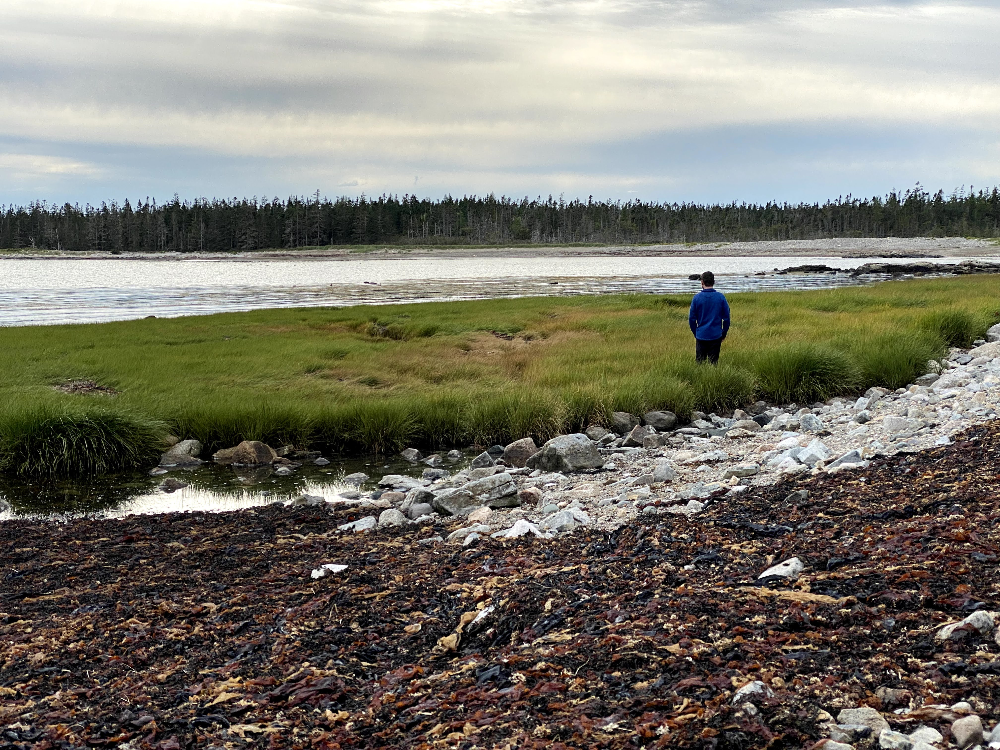

{width=80%}

I’m a river scientist and fluvial hydrologist interested in transport processes, broadly defined and at large scales. To do this I use geospatial data science, machine learning, remote sensing, and in situ studies. See my [research](/research/) page for more!!

current home: <a href="https://raymond-lab.yale.edu/" target="_blank">yse</a>/<a href="https://yibs.yale.edu/" target="_blank">yibs</a>

past homes: <a href="https://blogs.umass.edu/cjgleason/" target="_blank">fluvial@umass</a> <a href="https://wp.geog.mcgill.ca/hydrolab/" target="_blank">global hydrolab</a>

personal: <a href="https://scholar.google.com/citations?user=QeBtmYkAAAAJ&hl=en&oi=ao" target="_blank">google scholar</a> <a href="https://orcid.org/0000-0001-6701-4835" target="_blank">orcid</a> <a href="https://github.com/craigbrinkerhoff" target="_blank">github</a> <a href="https://linkedin.com/in/brinkerhoff" target="_blank">linkedin</a>

contact: craig [dot] brinkerhoff [at] yale [dot] edu
