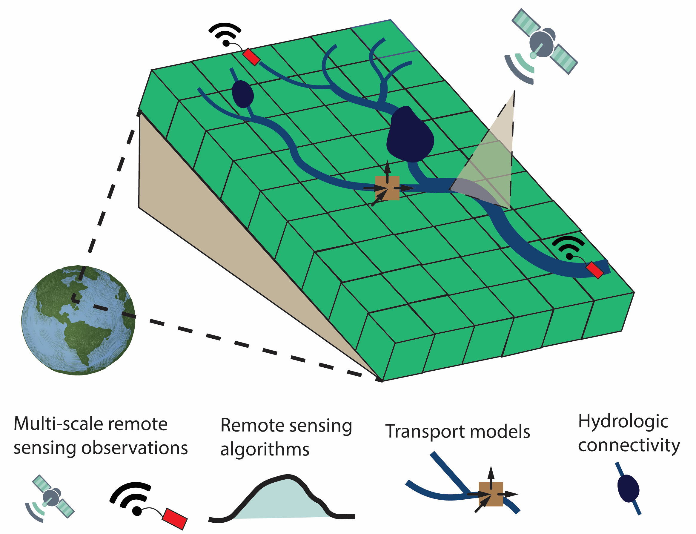

2023 &#169;craigbrinkerhoff

Drainage networks are the arteries of the continents, an interconnected network of rivers, streams, lakes, reservoirs, wetlands, and more that drain the land surface and transport water, sediments, nutrients, and other ‘stuff’ downstream or to the atmosphere. Sustainable management of global freshwater resource issues requires not only a knowledge of hydroclimatic processes across a range of scales, but also the toolkit (models, remote monitoring networks, and computational frameworks) to explore potential solutions. My work seeks to build this toolkit by taking a broad, cross-disciplinary approach to surface hydrology. I develop and combine (1) remote sensing algorithms, (2) numerical transport models, and (3) hydrological connectivity and hydraulic geometry theories to better understand global surface water and nutrient cycling. **Approaching global hydrology and biogeochemistry this way (through the lens of multidisciplinary river science) provides a framework- and the computational toolkit- necessary to sustainably manage global freshwater resources.**

-------------------------------

## Measuring rivers from space
- What properties of global rivers can we measure using satellites?
- What new knowledge do these measurements reveal about global hydrology?
- **Representative papers:**
  - [Constraining remote river discharge estimation using reach-scale geomorphology](https://doi.org/10.1029/2020WR027949)
  - [Inversion of river discharge from remotely sensed river widths: A critical assessment at three-thousand global river gauges](https://doi.org/10.1016/j.rse.2023.113489)
  - [Remotely sensing river greenhouse gas exchange velocity using the SWOT satellite](https://doi.org/10.1029/2022GB007419)

## Transporting 'stuff' downstream
- How do organic matter, pollutants, and other elements move through drainage systems?
- How does geomorphology and hydrology modulate downstream water quality?
- **Representative papers:**
  - [Lake morphometry and river network controls on evasion of terrestrially sourced headwater CO2](https://doi.org/10.1029/2020GL090068)
  - [Watershed DOC uptake occurs mostly in lakes in the summer and in rivers in the winter](https://doi.org/10.1002/lno.12306)
  - [Global controls on DOC reaction versus export in watersheds: A Damkhler number analysis](https://doi.org/10.1029/2021GB007278)

## Mapping the human footprint on global surface waters
- What do the above techniques reveal about human impacts on hydrology?
- How do both physical and political actors impact river water quality globally?
- How far downstream are these impacts felt?
- **Representative papers:**
  - In the pipeline...