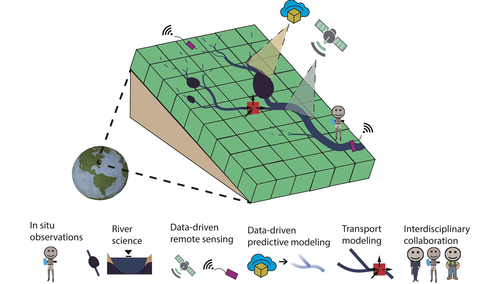

2025 &#169;craigbrinkerhoff

Drainage networks are the arteries of the continents, an interconnected network of rivers, streams, lakes, wetlands, and more that drain the land surface and transport water, sediments, and nutrients downstream. Rivers are the landscape's integrators, and exert a powerful influence on the ecosystems and communities through which they flow.

My work is guided by two research questions: (1) how does fundamental river science improve our understanding of global Earth system cycling? And (2) how might that inform efforts to sustainably manage freshwater resources? To answer these questions, I believe river science must draw on a broad, multi-disciplinary body of work and study transport phenomena across scales.

I develop geospatial machine learning and remote sensing methods while working directly with field and policy researchers throughout the pipeline. I have particular interests in fluvial transport phenomena, hydrological connectivity, hydraulic geometry, headwater systems, and global observational monitoring. By taking a broad, integrative approach that draws on multiple traditions while remaining strongly "data-driven", we develop a more clear understanding of how river basins contribute to the Earth system under ongoing global environmental change.

-------------------------------

## Constraining global river fluxes
- What role do surface waters play in the global cycling of water, nutrients, and sediments?
- What role do humans play in regulating these processes?
- **Representative papers:**
  - [Accelerating river discharge in High Mountain Asia]()
  - [The importance of hydrology in routing terrestrial carbon to the atmosphere via global streams and rivers](https://doi.org/10.1073/pnas.2106322119)

## Understanding the role of small streams
- How much do the headwaters impact downstream rivers and watershed export?
- What is the extent of headwater streams?
- **Representative papers:**
  - [Ephemeral stream water contributions to United States drainage networks](https://doi.org/10.1126/science.adg9430)
  - [Detecting proglacial headwater streams in High Mountain Asia using Planet imagery](https://doi.org/10.1016/j.rse.2024.114124)

## Understanding how 'stuff' moves downstream
- How do organic matter, nutrients, and sediments move through watersheds?
- How does hydrological connectivity impact water quantity and quality?
- **Representative papers:**
  - [The importance of source data in river network connectivity modeling: a review](https://doi.org/10.1002/lno.12706)
  - [Towards modeling continental-scale inland water CO2 emissions](https://doi.org/10.1029/2024AV001294)
  - [Global controls on DOC reaction versus export in watersheds: A Damköhler number analysis](https://doi.org/10.1029/2021GB007278)

## Advancing global surface water monitoring
- What river properties are remotely sensible?
- What new hydrological understanding is revealed through these technqiues?
- **Representative papers:**
  - [Constraining remote river discharge estimation using reach-scale geomorphology](https://doi.org/10.1029/2020WR027949)
  - [Remotely sensing river greenhouse gas exchange velocity using the SWOT satellite](https://doi.org/10.1029/2022GB007419)
  - [A framework for estimating global river discharge from the surface water and ocean topography satellite mission](https://doi.org/10.1029/2021WR031614)