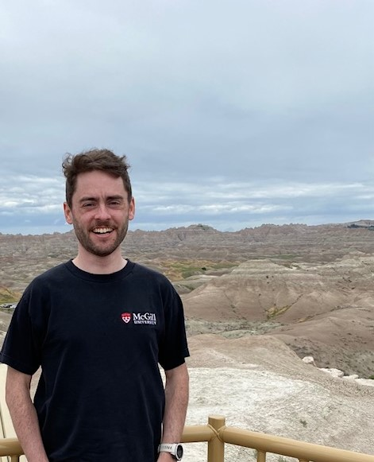
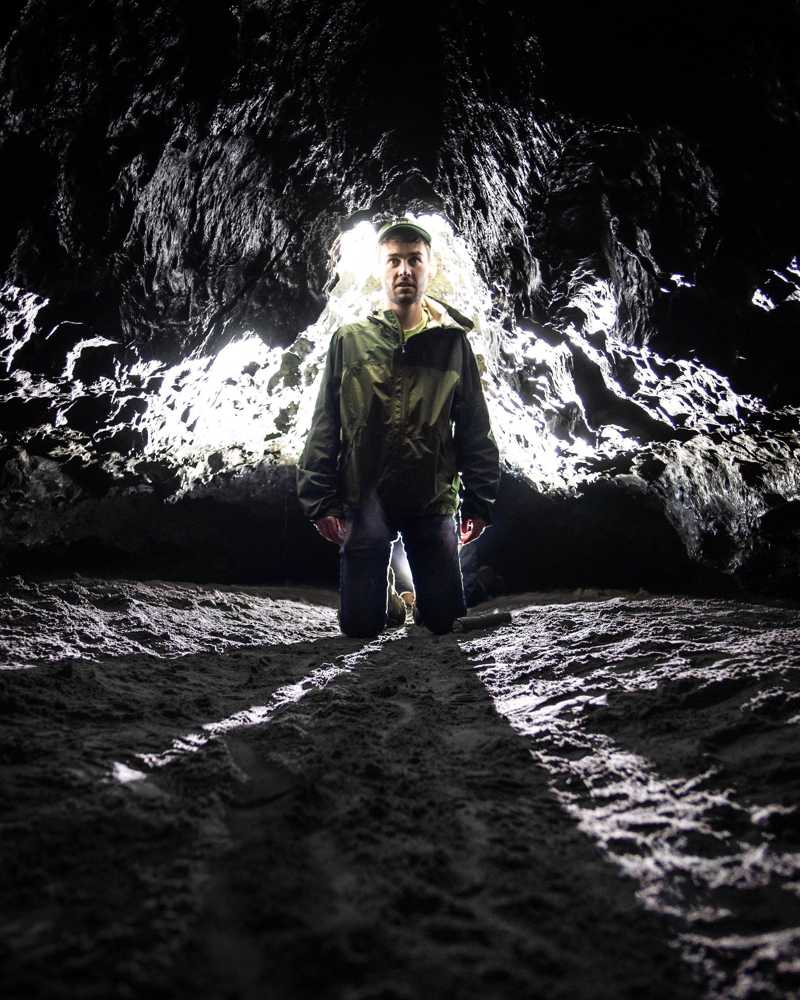

 

{width=40%} {width=32%}

 

My name is Craig Brinkerhoff and I am a PhD candidate in the [Fluvial@UMass group](https://blogs.umass.edu/cjgleason/) in Civil & Environmental Engineering at the University of Massachusetts, Amherst. My interests are in large-to-global scale modeling and remote sensing of river network hydrology and biogeochemistry.

   
Feel free to contact me at cbrinkerhoff[at]umass[dot]edu!

  

 Site created using [RMarkdown](https://rmarkdown.rstudio.com) 
