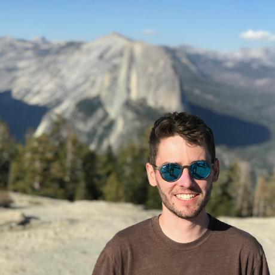

{width=40%}

 
My name is Craig Brinkerhoff (he/him) and I am a PhD candidate in the [Fluvial@UMass group](https://blogs.umass.edu/cjgleason/) in Civil/Environmental Engineering at the University of Massachusetts, Amherst. My interests are in large-to-global scale modeling and remote sensing of river hydrology and biogeochemistry and with a particular interest in hydraulic geometry.

I spend my spare time on music (mostly mandolin), single-origins, trail running, and cycling.

Feel free to contact me at cbrinkerhoff[at]umass[dot]edu!
